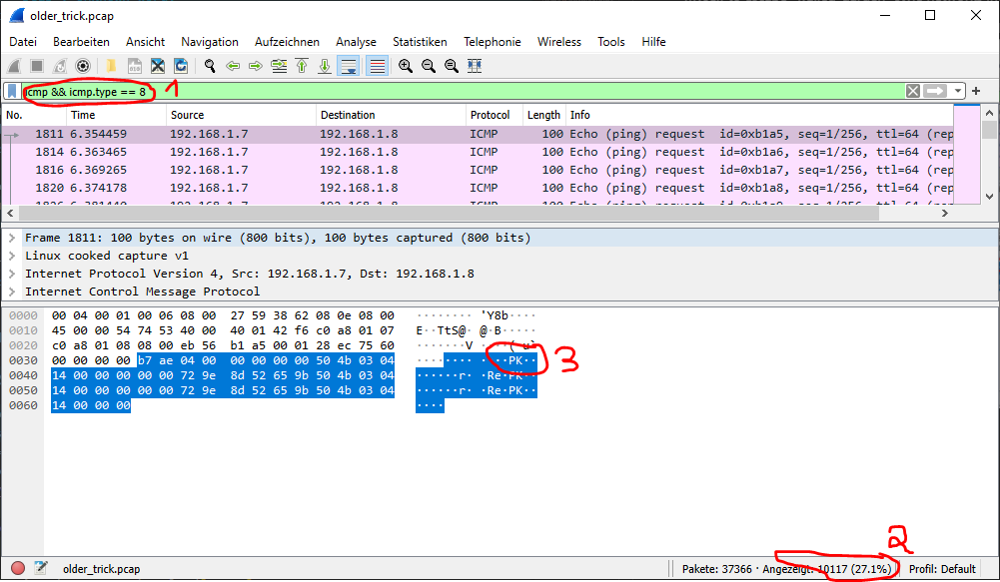

# Oldest trick in the book

## Challenge

```plain
A data breach has been identified. The invaders have used the oldest trick in the book.
Make sure you can identify what got stolen from us.
```

The download contains a `pcap` recording of some network traffic.

## Solution

I first loaded the `pcap` file into wireshark and had a look around for some
anomalies. The first thing I found a bit strange was the large amount of `ping`
(ICMP) traffic.

I've know for a while now that it's possible to tunnel TCP over ICMP and
sometimes used ICMP traffic myself to escape "walled-garden" style networks in
the past.

So I took a closer look at the ICMP packets themselves.


After filtering for ICMP packets (1) you can see that there is an astonishing
amount of ping packets (2) more than 27 percent of all packets in fact.

Looking at the data of the first package you can see the string `PK` or more
specific the hex string  
`50 4b 03 04` which is the [magic number][magic] of a `zip` file.

So i tried to dump the packet data by leveraging [`scapy`][scapy].

My code looke something like this:

```python
for packet in capture:
    try:
        typ = packet[ICMP].type
    except:
        continue
    if typ == 8:
        ping_data += packet.load
```

That didn't work because I was tired and doing silly work.

If you take a closer look a the packet data you can see the `PK` string
repeating three times... So after a taking a closer look I realized two things:

1. The `.load` of an ICMP packet contains the timestamp
2. The payload data itself was contained multiple time within the ICMP data

So I reduced the data written to disk to the relevant bytes and I received a
well formed `zip` file.

```python
from scapy.all import *

capture = rdpcap('older_trick.pcap')
ping_data = bytearray()
count = 0
for packet in capture:
    try:
        typ = packet[ICMP].type
    except:
        continue
    if typ == 8:
        ping_data += packet.load[16:32]


with open('test.zip', mode='wb') as f:
    f.write(ping_data)
```

Unzipping the file yielded a `fini` folder.


For everyone who ever back upped their firefox profile the contents of the
folder should be very familiar, since it _is_ a firefox profile.

So I imported it into firefox and took a look at the saved credentials an there
was the flag

[magic]: https://en.wikipedia.org/wiki/File_format#Magic_number
[scapy]: https://scapy.net/
